# 🐧 Repositório do Canal LinuxProativo!

Aqui você vai encontrar projetos, experimentos e ideias voltadas para desempenho, simplicidade e praticidade.

- 🎯 **Objetivo:**  
  Simplificar o uso e distribuição de aplicações no Linux, sem depender do sistema base.

- 💡 **Diferencial:**  
  Tecnologias focadas em portabilidade, isolamento e independência de distro.

O repositório LinuxProativo possui principalmente:
* 🛠️ **Ferramentas Destinadas ao Desenvolvimento de AppImage**
* ⚙️ **Ferramentas Destinadas ao Desenvolvimento de Binários Estáticos/Portáteis**
* 🦀 **Crates para o Ecossistema Rust**
* 📀 **Programas Empacotados em AppImage**
* 🐧 **Utilitários e Programas para Linux e Slackware (C/C++ e Shell Script)**

# ⭐ Principais Projetos

✨✨✨ Esses são os Projetos mais relavantes em desenvolvimento.
  

# 🦀 Projetos de Crates em Rust

✨✨✨ Todas as crates estão disponíveis em: https://crates.io/users/LinuxProativo
  

# 🖥️ Stacks e Atividades

  <a href="https://skillicons.dev">
     
    
     
  </a>
  <picture>
    <source media="(prefers-color-scheme: dark)" srcset="https://raw.githubusercontent.com/LinuxProativo/LinuxProativo/refs/heads/output/github-contribution-grid-snake-dark.svg"/>
    <source media="(prefers-color-scheme: light)" srcset="https://raw.githubusercontent.com/LinuxProativo/LinuxProativo/refs/heads/output/github-contribution-grid-snake.svg" />
    
  </picture>

